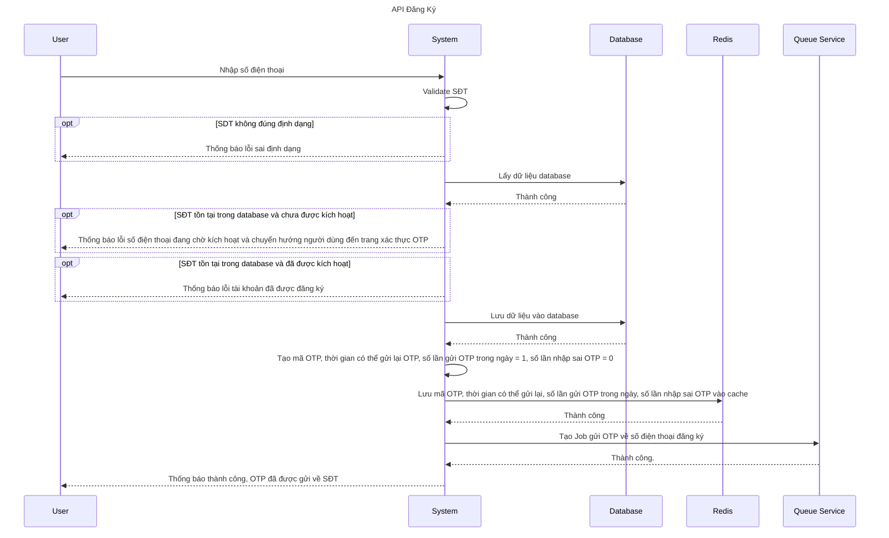
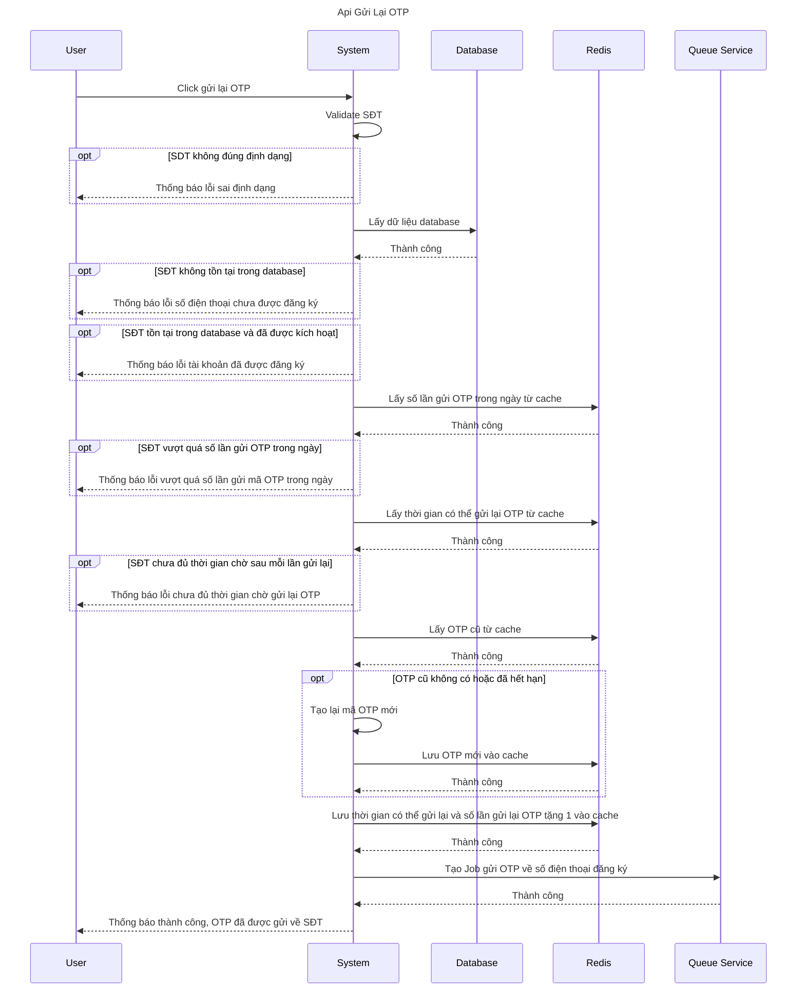
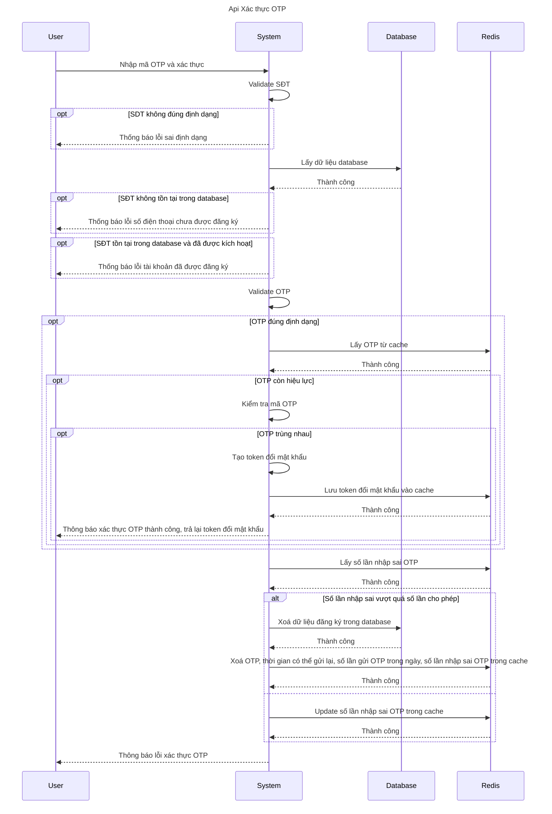
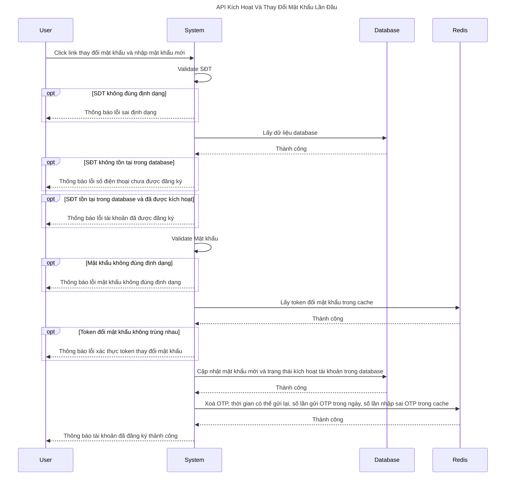
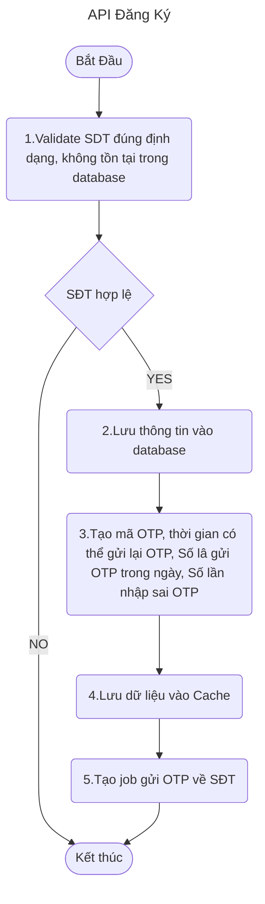
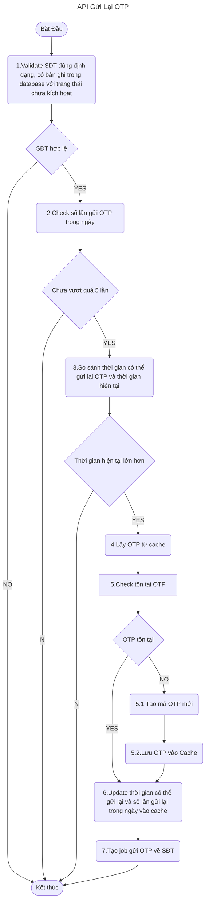
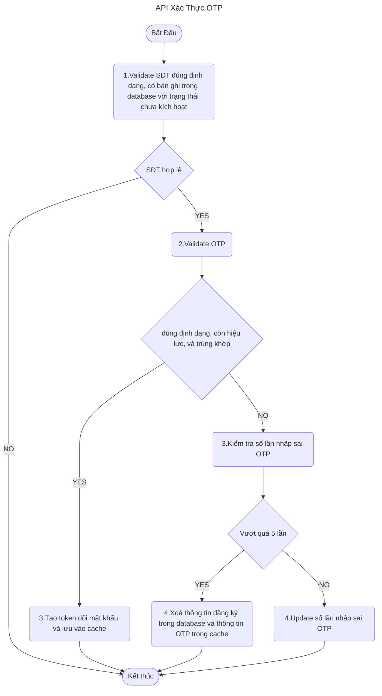
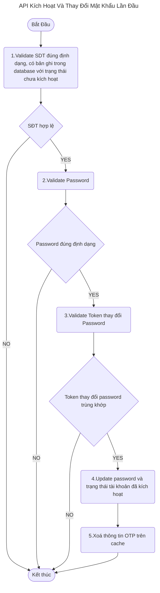

# Bài tập 1

Một phần mềm muốn có tính năng đăng ký cho người dùng mới.
Các thông tin để làm key xác thực người dùng:
- SDT với format: 84xxxxxxxx . Điện thoại tuân thủ đúng chuẩn của thế giới bắt đầu bằng số 84 và mỗi số điện thoại sẽ có 11 chứ số: Ví dụ 84982573860. Khi khách hàng nhập vào +84 hoặc bắt đầu bằng 0 => auto chuyển về 84
- Khi khách hàng đăng ký, sẽ có gửi OTP về sdt của khách hàng (Fake thôi, giá sử gửi otp thành công đi)
  OTP bao gồm 6 chữ số random, có thời hạn sống 3p.

Sau khi khách hàng được gửi OTP, thì sau 120s khách mới được gửi OTP tiếp (resend). Mỗi ngày khách được gửi tối đa 5 OTP.

Với mỗi OTP, khách được nhập sai tối đa 5 lần, nếu nhập sai lần thứ 5 => xoá phiên giao dịch khách hàng đăng ký không thành công.

- Sau khi khách hàng xác thực OTP thành công, lúc này khách hàng được cập nhật mật khẩu. Mật khẩu có rule là ít nhất 8 chữ số, bắt buộc phải có chữ và ít nhất 1 số, 1 kí tự đặc biệt, 1 chữ viết hoa.

  ---------------------------------------

**Yêu cầu :**
1. Học viên viết SRS
   - Sử dụng sequendiagram vẽ api foollow
   - Vẽ sơ đồ thực hiện.
2. Coding xong gửi lên git
3. Think về các yếu tố phi chức năng: perfomance của hệ thống , an ninh an toàn.

Khuyến khích học viên viết Gửi otp qua queue (Sử dụng rabbitmq hoặc queue nào đó) . Viết 1 service chỉ để nghe xong chả lzi

-----------------------------------------------------------------------

**Tóm tắt:**
- SĐT:
    - 11 chữ số nếu bắt đầu bằng 84
    - 12 chữ số nếu bắt đầu +84
    - 10 chữ số nếu bắt đầu 0
    - Khi lưu tự chuyển đổi về 11 chữ số và bắt đầu 84
      => Chỉ validate đúng định dạng 11 số, FE validate và tự chuyển định dạng gửi lên về đúng 11 số
- OTP:
    - Gồm 6 chữ số random
    - Thời hạn sống 3p(180s)
    - Gửi lại sau 120s
    - Mỗi ngày gửi tối đa 5 OTP
    - Mỗi phiên đăng ký, OTP được nhập sai tối đa 5 lần, nhập sai lần thứ 5 => xoá phiên giao dịch khách hàng đăng ký không thành công
- Password:
    - Có ít nhất 8 chữ số
    - Ít nhất 1 chữ viết hoa
    - Ít nhất 1 chữ viết thường
    - Ít nhất 1 số
    - Ít nhất 1 ký tự đặc biệt

**Phân tích:**
Các API cần triển khai:
- API đăng ký => input là số điện thoại => output là OTP code
Logic: check validate định dạng, kiểm tra số đt đã đăng ký chưa hoặc đang đăng ký không. Nếu có thì hiển thị thông báo, nếu không thì tạo cache lưu thông tin số điện thoại, mã OTP
- API gửi lại mã OTP => input là số điện thoại => output là OTP code
Logic: check validate tồn tại Sđt, check số lần gửi trong ngày hôm nay, check thời gian gửi gần nhất, check thời gian sống của otp, nếu hết hạn thì tạo lại và trả về
- API xác thực OTP => input là mã số điện thoại và mã OTP => output: token để thay đổi mật khẩu
Logic: check validate số điện thoại, check thời gian sống OTP, check đúng OTP, nếu không đúng OTP thì update lại số lần nhập sai, nếu đúng trả về token để thay đổi mk
- API Thay đổi mật khẩu lần đầu => input là số điện thoại và token thay đổi mật khẩu => output: thông báo đăng ký thành công
Logic: check token thay đổi mk, check validate password lưu thông tin xuống database

**Biểu đồ Sequance**

1. API Đăng Ký

2. API Gửi Lại OTP

3. API Xác Thực OTP

4. API Kích Hoạt Và Thay Đổi Mật Khẩu Lần Đầu

**Biểu đồ Flow**

1. API Đăng Ký

2. API Gửi Lại OTP

3. API Xác Thực OTP

4. API Kích Hoạt Và Thay Đổi Mật Khẩu Lần Đầu

